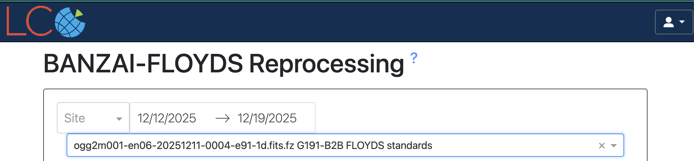
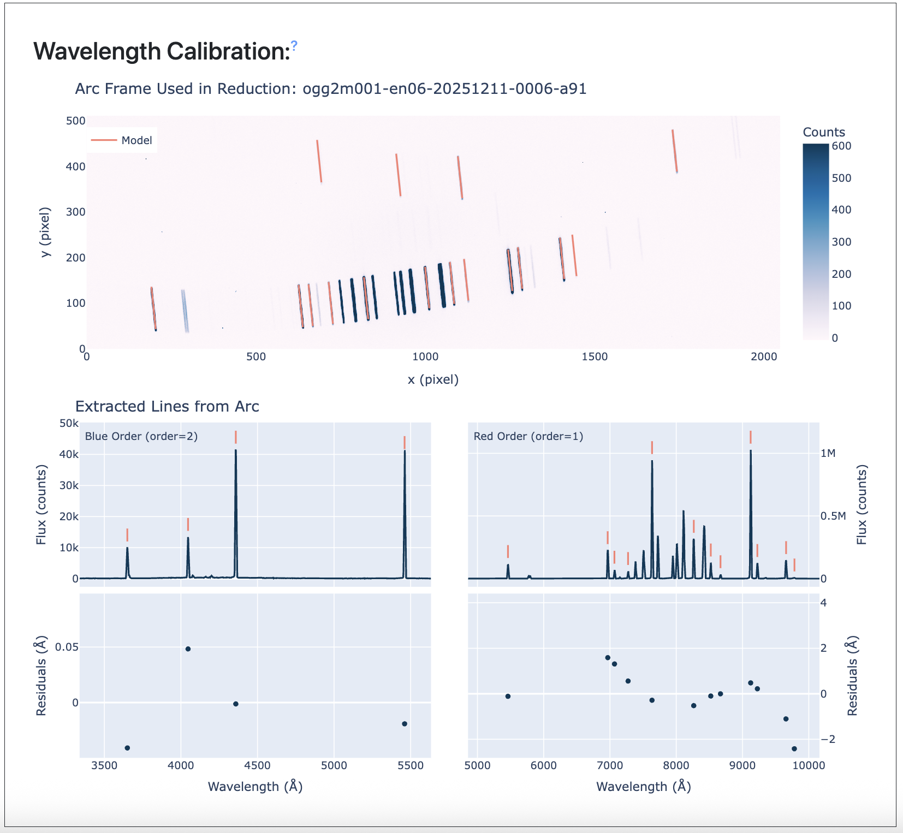
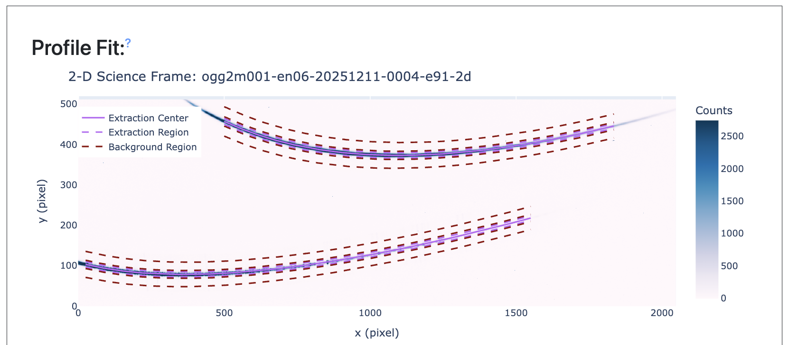
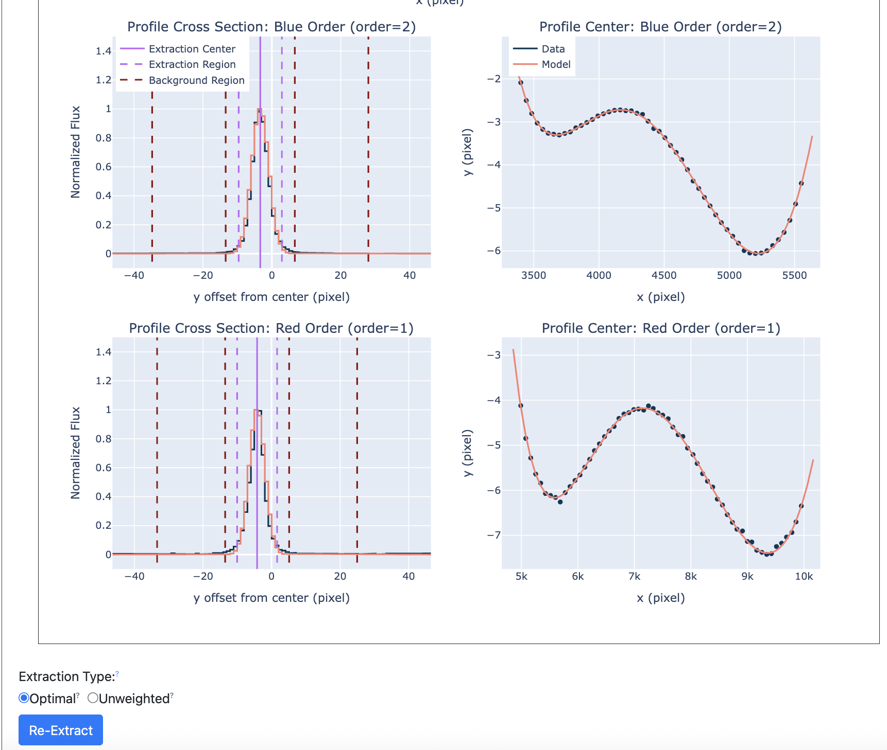
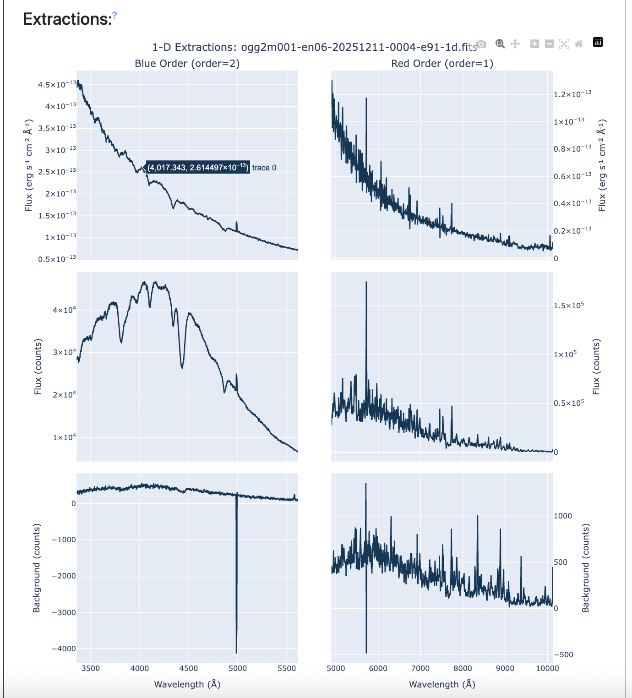
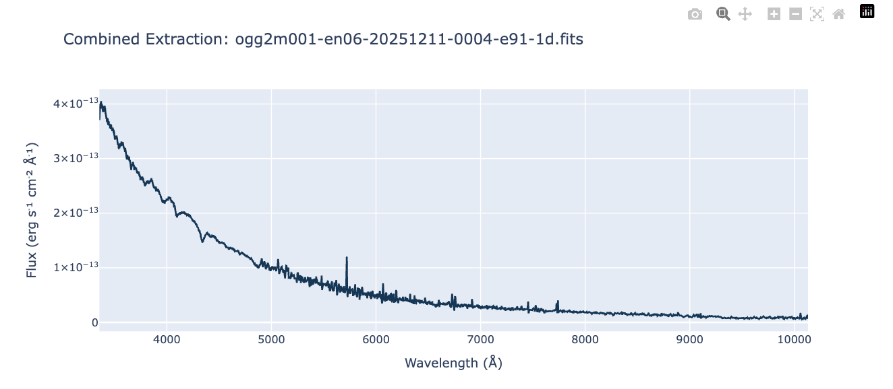

Re-Extraction GUI
=================
The BANZAI-FLOYDS Re-Extraction GUI (Graphical User Interface) allows users to re-extract their data using a different weighting scheme (optimal vs un-weighted) and to choose the precise region used for the extraction for the background estimation.

File Selection
--------------

Files are selected using the dropdown menu near the top of the page. To see private data (or to save an extraction to the archive), a user must be logged in which can be done using the button in the upper right corner of the page. The date range defaults to data taken in the last week and can be updated with the date range picker. The list of spectra is selected by searching for 1d spectra in the archive, so if there was a crash processing a file, it may not appear in this list and the user should contact Science Support.

Wavelength Calibration
----------------------

The wavelength calibration section shows the quality of the wavelength solution for the arc used for the extraction. This shows both the 2d arc image with identified lines and a 1d extraction with identified lines and residuals from the best fit model. In the red, the residuals are typically significantly smaller than a wavelength resolution element, but the scatter is not fully random to avoid overfitting in regions in the arc lamp with too few or no lines.

Profile
-------

This is the primary user interaction section of the re-extraction GUI. The user can drag the lines to the left and right on the 1d profile plots to update the background region or the extraction region. The lines are updated automatically on the 2d image to show the corresponding region across the full frame. The background region has a minimum width of 5 pixels on either side of the object region to keep the background fit from having issues. If the background region goes off the edge of this chip, this is only a plotting artifact. The user can select between optical (Horne) or un-weighted extractions using the selection below. Once the user is satisfied with their selection, they can click the "Re-Extract Spectrum" button to perform the extraction. This may take a few moments depending on server load.

Extraction
----------

The next section shows the 1d extraction results of the re-extraction. These plots are updated everytime the re-extract button is pressed. The plots show the flux corrected, raw extracted, and background for each arm of the spectrum. Finally, we display the combined, flux corrected spectrum. Once the user is satified with the extraction, they can click the save button. This will post to the re-extracted spectrum to the normal Las Cumbres Observatory archive. If the user downloads the file again, it will default to the newest, re-extracted version. Other versions are avaiable through the API.
